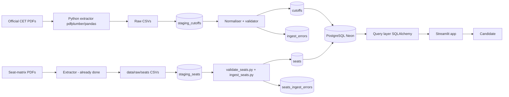

# Architecture

## System Overview
Data flows: CET PDF → CSV → staging table → normalised tables →
PostgreSQL → Streamlit app.

## System Diagram

## Tech Stack
- Python 3.11
- pandas 2.2, pdfplumber 0.11
- SQLAlchemy 2.0
- SQLite (dev) / PostgreSQL (prod)
- Streamlit 1.40
- Plotly 5.24

## Repository Structure
(see README)

## Application Layers
- **Ingest:** scripts/validate_data.py, scripts/ingest.py (cutoffs);
  scripts/validate_seats.py, scripts/ingest_seats.py (seat matrix)
- **Data:** db/schema.sql, PostgreSQL
- **Query:** src/cet_cap/db.py, queries.py
- **UI:** app/Home.py

## Database Architecture
- Reference: institutes, programs, base_categories, sections, stages,
  allocation_lanes
- Fact: cutoffs, seats
- Audit: staging_cutoffs, ingest_log, ingest_errors,
  staging_seats, seats_ingest_log, seats_ingest_errors

## API Architecture
No external API. Direct DB access from Streamlit via SQLAlchemy
with parameterised queries.

## External Services
- Neon / Supabase (PostgreSQL)
- Streamlit Community Cloud
- Sentry (error tracking, PII off)

## Data Flow
1. CSVs land in data/raw/.
2. `validate_data.py` runs the block-context forward-fill (see
   below) and checks every row against the reference whitelists
   before anything is loaded — this is a read-only quality gate,
   not part of the load path itself.
3. ingest.py loads each row into staging_cutoffs.
4. Parser decomposes raw_category into (base, ladies, section).
5. Valid rows inserted into cutoffs.
6. Invalid rows AND quarantined extraction anomalies (see
   DECISIONS.md) written to ingest_errors, never silently dropped.
7. Ingest summary written to ingest_log.

## Block-context forward-fill (validated against real data)
The source PDFs print institution_code, institution_name,
program_code, program_name, status, and section **once per block**,
then leave those six columns blank on every subsequent row until the
block changes. `validate_data.py` forward-fills all six together as
a single group, per file.

Two columns are deliberately excluded from this fill:
`home_university` and `stage`. Both were found to be 100%-blank
across entire files in real data (not per-block gaps), so
forward-filling them would fabricate values that were never
extracted from the source PDF. See `docs/DECISIONS.md` for the full
investigation.

## Seat-matrix data flow (F5, added 2026-09-12)
The seat-matrix source is structurally different from cutoffs and
gets its own pipeline rather than being forced through
validate_data.py/ingest.py:
- No year/round in the source at all (see PRD Assumption A8) —
  `capture_year` is an ingest-time CLI argument, not parsed from
  the file.
- Every row is fully populated (no forward-fill needed) — the
  cutoffs source's "print once per block" layout doesn't apply
  here.
- `choice_code` (seats) and `program_code` (cutoffs) are the same
  CAP option-code format and are the intended join key between the
  two fact tables — there is no separate program-name column in the
  seat matrix.
- `allocation_type` (HU/OHU/State Level/PWD/DEF) is a distinct
  dimension from `cutoffs.section_code` — modelled as its own
  `allocation_lanes` reference table rather than reusing `sections`,
  because PWD/DEF have no HU/OHU split in this source even though
  they do in cutoffs (see DECISIONS.md).
- Each (institution, choice_code, lane) block ends with its own
  `category = 'Total'` subtotal row from the source PDF. This is
  cross-validated (sum of that block's category rows must equal its
  Total row) rather than treated as just another category — treating
  it as a real category would double-count seats in any rollup.
1. Seat CSVs land in data/raw/seats/.
2. `validate_seats.py` checks every row against category_whitelist,
   allocation_lane_whitelist, and seat_category_aliases, plus the
   Total-row reconciliation — a read-only gate, same discipline as
   validate_data.py.
3. `ingest_seats.py` stages each row into staging_seats, derives the
   canonical institution_code from choice_code's prefix (the
   institution_code column itself loses its leading zero through
   some tooling — see DECISIONS.md), and inserts into `seats`.
4. Quarantined/failed rows go to seats_ingest_errors, never silently
   dropped; a per-file ingest_seats_log row records read/inserted/
   skipped/failed counts, and the loader asserts they sum to the rows
   read.

## Architectural Patterns
- ETL: staging then normalise.
- Idempotent loads (ON CONFLICT DO NOTHING).
- Read-only query layer for UI.

## System Boundaries
- ETL runs on dev machine, not on Streamlit Cloud.
- Streamlit reads only from the deployed PostgreSQL.
- No user data leaves the browser.

## Scalability Considerations
- Current dataset: 30 cutoffs files (67,770 rows) + 4 seat-matrix
  files (70,269 rows); fits in memory.
- Add partitioning by year if >5M rows.
- Materialised view for "latest cutoff" if queries slow.

## Security Architecture
- Parameterised SQL only.
- Sentry send_default_pii=False.
- No user input logged.
- secrets.toml never committed.

## Deployment Architecture
- Postgres: Neon free tier
- App: Streamlit Community Cloud, reads DATABASE_URL from st.secrets
- ETL: run manually from dev machine
- Backups: Neon automatic

## Architecture Decisions
See DECISIONS.md.

## Constraints
- Free-tier only.
- Python-only.
- Streamlit Community Cloud build memory limit.

## Static runtime cutoff-data strategy

The master SQLite database and raw source PDFs are build-time assets and are not shipped to the browser. The build/export step precomputes the college-specific cutoff payloads under `site/data/college_cutoffs/<COURSE>/<COLLEGE>.js`. Drawer runtime loads only the selected college's payload, while the college-specific catalog drives the Category and Quota/Type controls. This avoids runtime aggregation and avoids loading a multi-megabyte course-wide cutoff file for every drawer. Publicly displayed cutoff values remain extractable because they are intentionally displayed; the private master DB is never exposed.
